## FSMs {#fsms}

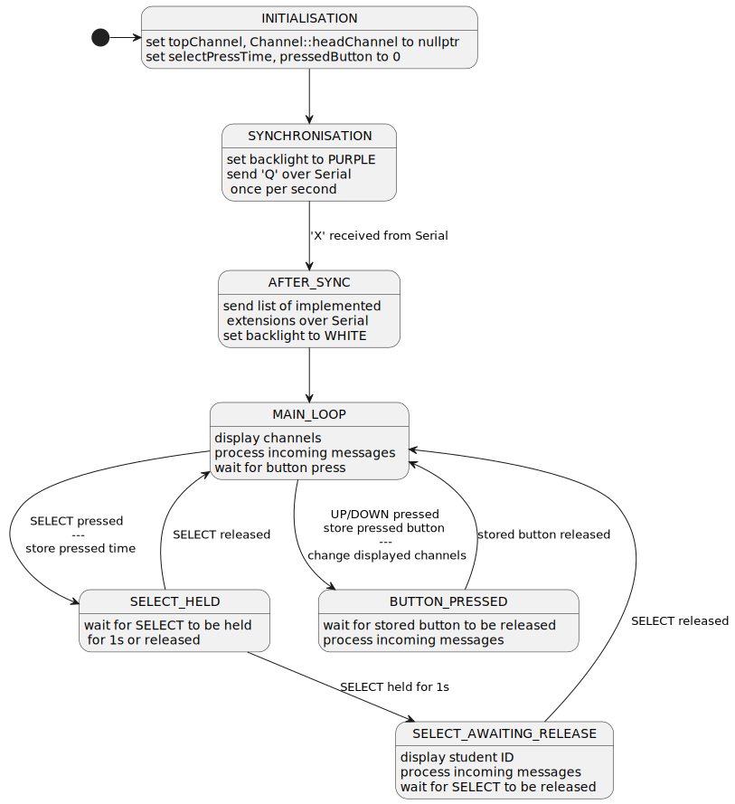

<!--
http://www.plantuml.com/plantuml/uml/XPBFZfim4CRlVegvHQesQdlbK2sxeGrI2ZGGfLMf8e8dYLKpHhRPTj--9Y4i4Acv83oUR_xu-pqQMsZRL9AT14V0ghQlmD6KMjHMA68iZC8iz5TXwcTX77bWq89LzVEf84Bv0DsFvvsmuDt19G0rKjPMvvIpLc9GOcaJZSPaei87gDjVv4-DjOfQmGUM_eYUb-iu6lNQ5-LlAOwdjYiactMo2d8oI1nctsQWNb13YbeKCYTGL2BKBcAmLCIP_paBrhksh0TdYHJ6WZg0g6g95P95xcJuro8PjwqPrxjflrs6MS2--c6qMyLnuW4NffR5AvINlKrEjLOb6WE2IbK9EaBbJiKHtTMVGbWuA0txyywN5s1fi0gUizqoM2qyw5CkqRRd7k64iXspZNyquBuQ9HO6-LNiRtrdKlHbjtPdFmtU1ZEsuKWMmiNTqMxxzcsUDbaMHxja7QHfC1pJMAMHTmjDLFzfoDZFTxzW_Wd6S4rOWxdBc30nPgJB6Tey-pu3ZIMA5-HmqAhgt1omSDRq9h8tFyyNGp-wmvLLo6a-d-TqMRkFMiVpfCZqmJR9-qMyZGQ5nYMw1-pgjpGTyUeXyXulDgHbEEqKW7xo5fqEd1jjFtAVVO-hUx89ADFqCIszwX69DvNy1m00
-->

My code includes other FSMs in the extensions. With all extensions implemented, the main FSM changes to (changes highlighted by italics):

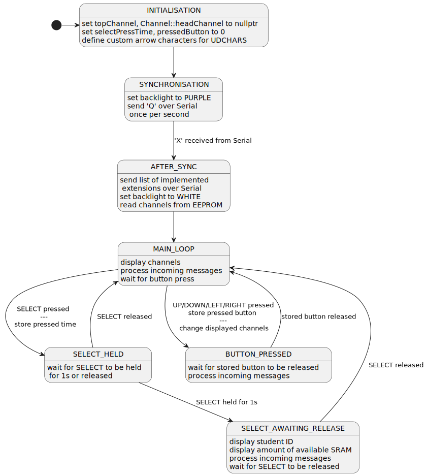

<!--
http://www.plantuml.com/plantuml/uml/XLFHRfim57tdA-vRfAaHssiUfjA4DaWfC23gfZ553huDreoDRDEkVpz32A6UjBv4s3xdtdlEFRdLXYZJDToh6KN0fZLlG55NYhM6IU5vKHmLKR2Byg28adW56WqOsQvh8WJo6nW_LgiQ2HqF5W2YuxmrgXIbrrCqSgnCgb3hWZLu0st_YVIkCqQAdl2vX_e-nMSc4AfE6za0KKg-GbKJHIg3IiEpLB3VhBT1blk-b_-8rziiYTzDToJLRyvETJydfFiitOMbq2WeBBujGBwWWXmL8xmK84M5qAAon4eAwWNtHPWT-h8h62YSQGFo6LZJScnG6AIMXdyC2ctzqU_h_TF-QHiLjhllAoGKghCzLeMosi8mpP97g-8nYEB3BadI5L2cMqxU9cGfMYKhr1gOg6J3n0aQUo8dj4-lX9d1aEDWujbIBmztuReuRCFTPWKJv7pRZtH4g97tAlhxBnhihqAEH2Eza8Edm6uzVZXazXpauNKmRJgAma2qwLLTRaaZEp7uH5u8u-J84V8iiE8-5k1ETntcRbyKINn8ip3FmxaORQH2EifsMFzfw7a_F_s2vLTudsaduh2q22TORj06p3mhY-yBK5WXUq4wR7UCn2nG0sTQjNVT-l0mtzfukFn5e1JBvR8KPzdJhM4DEaLSm_QflqcUOdyNtXT-5ZrivpNdrIOlnrPz_4vuMJfUa-lDupKVt4tC9ABFsfWqXpjpOq9_5CIFQ4vc7BWJd8brYu9s3VyB
-->

#### INITIALISATION {.unnumbered}

This state carries out the actions involved in initialising and setting up the system. Once complete, the system enters the `SYNCHRONISATION` state.

#### SYNCHRONISATION {.unnumbered}

This state carries out the 'synchronisation phase' defined in the specification. The system will stay in this state until synchronisation with the host is complete, thence the system will enter the `AFTER_SYNC` state.

#### AFTER_SYNC {.unnumbered}

This state carries out the actions after the synchronisation phase, as defined by the specification. Once complete, the system enters the `MAIN_LOOP` state.

#### MAIN_LOOP {.unnumbered}

This state carries out the main phase. In this state, the system waits for messages from the host and button presses, and displays information about channels.

When `SELECT` is pressed, the system enters the `SELECT_HELD` state.

When `UP` is pressed, the system enters the `BUTTON_PRESSED` state.
Once it is released, the program will display the channel before the channel currently displayed on the top line.

When `DOWN` is pressed, the system enters the `BUTTON_PRESSED` state.
Once it is released, the program will display the channel after the channel currently displayed on the bottom line.

#### SELECT_HELD {.unnumbered}

This state waits for `SELECT` to be held for 1 second. Once that happens, the LCD backlight turns purple, my student ID is displayed, and the system enters the `SELECT_AWAITING_RELEASE` state. If `SELECT` is released before 1 second, the system enters back into the `MAIN_LOOP` state.

#### SELECT_AWAITING_RELEASE {.unnumbered}

In this state, the system waits for `SELECT` to be released. Once it has been released, the LCD is cleared and the system enters back into the `MAIN_LOOP` state.

#### BUTTON_PRESSED {.unnumbered}

In this state, the system waits for the stored button (`UP`/`DOWN`) to be released, implementing a proper button press.
This is 'blocking', if multiple buttons are pressed, only the actions for the first one are carried out.

Once the button is released, the system enters back into the `MAIN_LOOP` state.

## Data structures {#ds}

### Types

#### Enum `State`

The states in the main FSM (see figure \ref{main-fsm}) are defined in the typedef'd enum `State`. This current state is statically stored in `loop()#state`.

An enum was used as it allowed me to define named constants and use them with some type safety, through using an `enum class` would have provided more type safety.

#### Struct `Channel`

Channels are implemented as an ordered singly-linked-list, ordered by channel ID.
This is implemented using the typedef'd struct `Channel`:

Table: `Channel` struct

| Type | Name | Description |
| --- | --- | --- |
| char | id | This channel's ID (A-Z)|
| const char* | desc | This channel's description/name/title (max. 15 chars) |
| byte | descLen | The length of this channel's description |
| byte | max | This channel's maximum |
| byte | min | This channel's minimum |
| channel_s* | next | Pointer to the next created channel (by ID) |
| byte | scrollIndex | SCROLL: the start index of the currently displayed description (see \S\ref{SCROLL}) |
| unsigned long | lastScrollTime | SCROLL: the time the description was last scrolled |
| ScrollState | scrollState | SCROLL: the current state of scrolling this channel's description |

NOTE: This struct has more attributes, which are determined by the macro `RECENT_MODE`, see \S\ref{RECENT}.

The instances of `Channel` are:

- `Channel::headChannel`
- `loop()#topChannel`
  - the channel currently displayed on the top line

The head of the channel linked list (LL) is stored statically in `Channel::headChannel`. When a new channel is created using `Channel::create(char, char*, byte)`, the LL is updated using `Channel::insertChannel(Channel*)`, which will insert the new channel into the appropriate position, according to the channel's ID.

Table: Static `Channel` functions

| Function Signature | Description |
| --- | --- |
| `insertChannel(Channel* ch)` | Inserts the given channel into the LL of channels in its appropriate position |
| `create(char id, const char* desc, byte descLen)` | Creates a new channel with the provided ID and description if not already created, else updates description of channel |
| `channelForId(char)` | Returns the channel with the provided ID, or `nullptr` if not yet created |
| `firstChannel(HciState)` | HCI: Returns the first channel in the LL that matches the current HCI state (see \S\ref{HCI}) |
| `channelBefore(Channel*, HciState)` | Returns the channel before the provided channel in the LL, that matches the current HCI state |
| `channelAfter(Channel*, HciState)` | Returns the channel after the provided channel in the LL, that matches the current HCI state |
| `canGoUp(Channel*, HciState)` | Returns whether there exists a channel before the provided channel in the LL, that matches the current HCI state |
| `canGoDown(Channel*, HciState)` | Returns whether there exists a channel after the provided channel in the LL, that matches the current HCI state |

When `UP` is pressed, `Channel#canGoUp` is called to check that there exists a channel before the one currently displayed on top, and if there is then `Channel#channelBefore` is called to get it and `loop()#topChannel` is updated.
When `DOWN` is pressed, the same process occurs but using `Channel#canGoDown` and `Channel#channelAfter`.

I chose to use a LL over an array of pointers as although it makes the logic more complicated, I felt it was a cleaner solution and it made getting the channel before/after a channel easier if there uncreated channels.

#### Struct `SerialInput`

I encountered a problem when processing incoming messages while `SELECT` is being held: sometimes the serial receive buffer buffer would not have everything entered to the Serial Monitor, e.g. I entered `VA5` but `Serial.available()` would return 2 not 4, though later calls would eventually return 4.

This forced me to store what has been previously read from the Serial interface, which is stored in the typedef'd struct `SerialInput`:

Table: `SerialInput` struct

| Type | Name | Description |
| --- | --- | --- |
| static constexpr byte | INPUT_LEN | The maximum number of bytes to read from the Serial interface |
| char[ ] | input | What has been read so far |
| byte | inputLen | The number of characters read so far |
| Channel** | topChannelPtr | Pointer to the pointer that stores the channel displayed on the top line |
| HciState | hciState | HCI: The current state of the HCI FSM (see \S\ref{HCI}) |

Using a struct also made it easier to pass around information - instead of a function having multiple parameters representing each aspect of `SerialInput`, it would just take in a `SerialInput`.

The function `handleSerialInput(Channel**, hciState)` statically stores the only instance of `SerialInput` and is responsible for handling any messages received from the host.
When a message has been completely received, if it conforms to the protocol then `handleCreateMessage(SerialInput&)` (first char C) or `handleValueMessage(SerialInput&)` (first char V, X or N) will be called and carry out the actions specified by the documentation.

### Constants (Macros)

I stored my student ID and my list of implemented extensions in the macros `STUDENT_ID` and `IMPLEMENTED_EXTENSIONS`.

#### LCD Backlight

To help with changing the colour of the LCD backlight, I used macros to define every color:

#### LCD

I used macros defining the column of where each characteristic of a channel will be displayed:

#### Timeouts

To held with the length of timeouts, I used macros:

## Debugging

Debug functions generally start with '`_`', and are commented with '`// debug`'.

The program will only send debug messages if the `DEBUG` macro is defined as a non-zero number.

Right after syncronisation is complete, the program sends multiple debug messages about the channels that have been created using values read from the EEPROM.

Whenever an erroneous message (not conforming to the protocol) is sent, a debug message about it is sent just before the error message.

## Reflection

I am mostly happy with my code, everything works as desired.

Though I am kind of unhappy that I mixed C & C++ constructs and did not really try to stick to one.

I am also unhappy that my implementation of RECENT is not the best - when `RECENT_MODE` is `LL`, not as many values are stored as I would have liked.
But I only store few values to ensure the Arduino does not ever run out of SRAM, at least because of my code.
It is possible to store more values but that does not ensure the Arduino will not ever run out of SRAM.

I am also happy that I was able to mostly eliminate my use of intermediate, short-lived strings (e.g. substrings) by directly accessing the initial string buffer, saving some memory on the stack.
For example, when displaying the channel description for the NAMES extension (`NAMES_SCROLL::displayChannelName(int, Channel*)`), instead of storing the substring of the channel's description (for scrolling purposes) then displaying it, I directly accessed the buffer.

I also feel like my program didn not properly reflect a proper finite-state machine. Some things could have been states, for example:

- when an incoming message does not conform to the protocol, the program could transfer to the state `ERROR`
- `ERROR` would essentially do what `processError(SerialInput)` does, then the system would enter back into the `MAIN_LOOP` state

But I felt that this did not make sense as a state, because the program flow for this would be more akin to a flowchart than a state machine - the system would not _stay_ in that state.
Furthemore, some states were not needed and could have been a transition, for example `AFTER_SYNC`.

## Extension Features {.unnumbered}

## UDCHARS

The namespace `UDCHARS` contains the code relating to the UDCHARS extension.

The following macros were defined, for use when creating and displaying the custom characters:

- `UP_ARROW_CHAR`   0
- `DOWN_ARROW_CHAR` 1

The change to the FSM was that in the `INITIALISATION` state, the custom characters are defined:

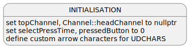

<!--
http://www.plantuml.com/plantuml/uml/BSknQWGX4CRntgUO1pWmzLQtkHGHmYLaDzqsehCew2Wp8o5l7uJj_XzylxkePnsrc9GZ0jQkVn1H0kUkkP4nxkbsjtwuRTtTvtC1GGLj_P4y4PORNB4i2Nsy1cW36gLqvOCECubWmQ1VZ29xhdY3FXFZwr1jDC7Bl5eRySo448Peg-2Pso-4vDa7HHOu6yFFs-Dz_TwiDNUaE6hv1m00
-->

In my code, this change was realised by calling `UDCHARS::createChars()` in the `INITIALISATION` state (line 781):

### Defining the arrows

The custom characters are defined in `UDCHARS::createChars()`, they were designed as 2 chevrons pointing in the appropriate direction (mirrored vertically), using [chareditor.com](https://chareditor.com):

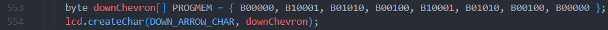

### Displaying the arrows

The arrows can be displayed to the LCD using `UDCHARS::displayUpArrow(bool)` and `UDCHARS::displayDownArrow(bool)`.

These functions have a single parameter `bool display`, which determines whether the arrows is printed to the LCD or a space is printed instead. This is indicative of whether a channel exists above the current `topChannel` or a channel exists below the current `btmChannel`.

Which are called in `updateDisplay(Channel*, HciState)`:

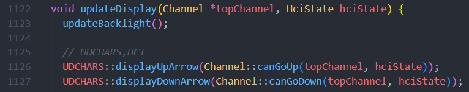

### Example

For example, if channels A, B and C have been created, the Arduino should look like:

As there are no channels before ("above") A, the up arrow is not displayed, a space is displayed instead. As there is a channel after ("below") B, the down arrow is displayed.

## FREERAM

The namespace `FREERAM` contains the code relating to the FREERAM extension.

The function `FREERAM::<unnamed>::freeMemory()` returns the number of bytes currently available in the Arduino's SRAM.

This can displayed to the screen, left justified, using `FREERAM::displayFreeMemory(byte)`:

The change to the FSM was that in the `SELECT_AWAITING_RELEASE` state, the Arduino will also display the amount of available SRAM:

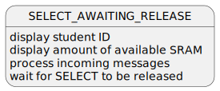

<!--
http://www.plantuml.com/plantuml/uml/DSr1IiKm483XVKunDyZUrGjQfA0kNX-uAPHfCwq3oIHa9aflRq5SVl_clwbXivwJ--98GBdQ2P5qQroDYpWt3M_3ysC9ds5yZ1-lo_roc8OdYAmruGbgFP8OZ2-pUFzVCPSk1cK7_4PEk2Q2wHxUlP-bjhAHAh1i9RCSa2_XGJhB3xB1NXhyRS4Ah0ID4g5IT3UIs7Fw1G00
-->

In my code, this was realised by calling `FREERAM::displayFreeMemory` in `selectDisplay()`.

Once SELECT has been held for at least 1 second. The Arduino should look like:

## HCI {#HCI}

HCI is implemented using a finite state machine with the states:

- NORMAL
  - display all channels
- LEFT_MIN
  - display channels where the current value is beyond the minimum
- RIGHT_MAX
  - display channels where the current value is beyond the maximum

<!--
http://www.plantuml.com/plantuml/uml/bOzDImD138Rlyojo5le7F4XxyAFGLYWU11KPTe8RoAJ39AFkltSPTJyK5deBUH-Uv5sh-Mmbicif861Cra50RJ8bevCuTxW_xZUxImYaYNq7dXcQreiWgzjTtpoyxhU7CJu9TqCE7sGja2aq9MSKWsTvzrmG65N1UgocaOHYYUwulRthVPl7itrl6RrXdYZzPrMwfuiNMAskuBl7Jvsw6Pwl4wICgXZ69nQOt_N4_8UO7XfhrV6_PfaQWjcrERD62INo5m00
-->

The HCI FSM is realised by the enum `HciState` and the function `Channel#meetsHciRequirement(HciState)`.

The function `Channel#meetsHciRequirement(HciState)` returns whether or not a channel is meant to be displayed according to the current state of the HCI FSM.

For example, channel A with {data: 30, min: 50, max: 255}, the display should look like:

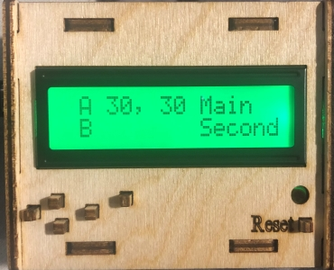

After `LEFT` has been pressed, the display should look like:

## EEPROM

The namespace `_EEPROM` contains the code relating to the EEPROM extension.

Each channel occupies 26 continguous bytes in the EEPROM:

Table: EEPROM Channels \label{eeprom-channels}

| # of Bytes | Description |
| ----- | --- |
| 1 | ID |
| 1 | Maximum value |
| 1 | Minimum Vaue |
| 1 | Description length |
| 15 | Description |
| 7 | My student ID |

The beginning address for a channel is calculated using `(id - 'A') * 26`, creating a distance of 26 bytes between the beginning addresses of each channel (A: 0, B: 26, C: 52, ...).

I stored my student ID in order to be able to check that the values in the EEPROM were written by me, see \S\ref{pers-val}.

### Writing to EEPROM

Modifications to the EEPROM are only done using 'update' functions and not 'write' function to prolong the life of the EEPROM.

Each characteristic of a channel that needs to be written to the EEPROM (see table \ref{eeprom-channels}) has a specific offset from the beginning address of the channel. These are defined by the following macros (`idAddr` is the beginning address - the offset for the ID is 0):

- `maxOffset(idAddr)       (idAddr + 1)`
- `minOffset(idAddr)       (idAddr + 2)`
- `descOffset(idAddr)      (idAddr + 3)`
- `studentIdOffset(idAddr) (idAddr + 19)`

Every time a channel's description, value, maximum or mimimum is updated, the EEPROM is updated using `_EEPROM::updateEEPROM(Channel*)`.
This ensures the EEPROM is kept up to date.

### Reading from EEPROM

The change to the FSM was that in the `AFTER_SYNC` state, the stored channels will be read from the EEPROM:

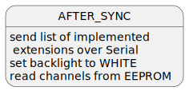

<!--
http://www.plantuml.com/plantuml/uml/3SvFgi8m40VWVKunDyZ-hVgGY2xyGriGeI2n-TK6aqd9ZAAtjmVuu6j4VTLNJcQE0OIyw9S2PAnnqLZOcFzjxzfRTprk_aZ0WL8KfJ9Hp4j21Yl2m8IFWcKLGkMDIXrgz6bWWTBTZyyK7xEI5hhizhqRsDeA7sYSFJEIq5HB9kVExUbWhMd0OKtz0000
-->

In my code, this was realised by calling `_EEPROM::readEEPROM()`:

The function `_EEPROM::<unnamed>::readChannel(char)` returns a pointer to the channel with the provided ID, with its values initialised by values read from the EEPROM.
`_EEPROM::readEEPROM()` is used to read all the channels from the EEPROM. This is done by iterating from A through to Z, getting the channel using `readChannel(char)`, and forming a linked list of channels, then returning the head of this linked list:

### Persistence Validation {#pers-val}

The mechanism to determine whether the values were written by me is a 3 step process:

1. Check that the written student ID is equals to my student ID
2. Check that the written ID matches the ID of the channel that should be written in that address
3. Check that the written description length is between 1 and 15 inclusive

Therefore, it is simple to 'invalidate' any written channel: by modifying the values written such that they fail any step in the above process.
For example setting the written ID to '@', similar to what is done by `_EEPROM::invalidateChannel(char)` and `_EEPROM::invalidateEEPROM()`.
Please see lines 764 - 765 in the code.

Although writing my student ID with every channel feels a bit excessive, I think it is the best mechanism to be able to verify that the values were written by **me** without being complicated.

## RECENT {#RECENT}

As RECENT seems to be impossible without making any compromise, it is implemented in 3 different ways, which make different compromises:

1. using a [queue with a maximum size](#queue-linked-list)
2. using a [circular array](#circular-array)
3. using an [exponential moving average](#exponential-moving-average)

You can choose which one the program uses by changing the macro `RECENT_MODE`.
 It is designed to be effectively an enum; its value should only be as one of the following defined macros:

- `LL` (linked list as queue)
- `ARRAY` (circular array)
- `EMA` (exponential moving average)

If `RECENT_MODE` is defined as any other value, the program will not compile.

### Queue (Linked List)

The compromise made by this implementation is that not all 64 values can be stored, unless another compromise is made elsewhere, e.g. limiting the number of channels that can be created.

I use a queue (implemented with a singly-linked-list), with a maximum size defined by the macro `MAX_RECENT_SIZE`, which once exceeded will discard the head value.
I thought this was a genius solution as it only allocated memory when needed, no memory would be 'wastefully' allocated.

`Channel#recentHead` stores the head of this linkedlist, and can be used for all list-related operations.

Table: `Channel` struct extra attributes

| Type | Name | Description |
| --- | --- | --- |
| RecentNode* | recentHead | the head of the RECENT linked list for this channel |
| RecentNode* | recentTail | the tail of the RECENT linked list for this channel |
| byte | recentLen | the number of recent values currently stored |

### Circular Array

The compromise made by this implementation is that not all 64 values can be stored, unless another compromise is made elsewhere, e.g. limiting the number of channels that can be created.

I use a circular byte array of size `RECENT_ARRAY_SIZE`, overwriting the oldest value once a new value has been entered (after more than `RECENT_ARRAY_SIZE` values have been entered).

Table: `Channel` struct extra attributes

| Type | Name | Description |
| --- | --- | --- |
| byte* | recents | The array |
| unsigned long | nRecents | The number of values entered |

### Queue vs Circular Array

As using a queue or circular array make the same compromise, it makes sense to compare them.

While using a linked list will start off using less memory than an aray, because each node will use 5 bytes (1 for the value and 4 for the pointer of the next node), its memory usage will increase very quickly. Assuming `MAX_RECENT_SIZE` = 64, once 64 values have been entered, the linked list will take 320 bytes which is a lot more than the 64 bytes an array will take.

As the array uses less memory, it allows for an array of a larger size than the maximum size of the linked list, which _should_ give a more accurate average of the last 64 values.

Their memory usages can be seen below (assuming all 64 values are stored):

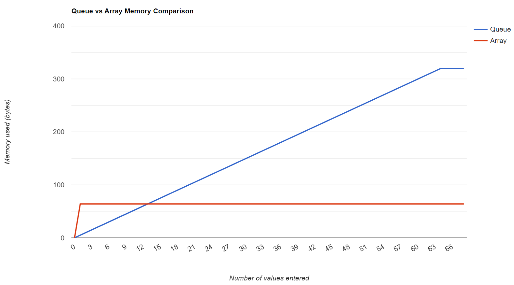

### Exponential Moving Average

The compromise made by this implementation is that the most recent values are not actually stored, and it is an estimation (though the other implementations are also estimations for the average of the most recent 64 values).
However, this _should_ give a closer estimate to the average of the most recent 64 values than the other two implementations as this takes the last 64 values into account, whereas the others can only take into account a very limited number of values.

I had to make a choice between using the average of all values entered and using an exponential moving average (EMA).
I decided to implement an EMA as it is more accurate for the average of the last 64 values.
More specifically, as the numbers of values entered increases, the more accurate an EMA is over a total average.

Table: `Channel` struct extra attributes

| Type | Name | Description |
| --- | --- | --- |
| byte | data | The most recent value |
| double | runningAvrg | The current estimated average |
| unsigned long | nRecents | The number of values entered |

The EMA implementation is based upon the recursive formula (from the [Wikipedia page](https://en.wikipedia.org/wiki/Moving_average#Exponential_moving_average)):

\begin{equation}
  y[n] = \alpha x[n] + (1 - \alpha)y[n - 1]
\end{equation}

Where:

 - $\alpha$ is the weighting for the new value
 - $y[n]$ is the new average
 - $y[n-1]$ is the old average
 - $x[n]$ is the most recent value

A drawback of using an EMA is that the early results are unreliable as the spin-up interval is not completed. In this implementation, the spin-up interval would be the first 64 values being entered.

I was able to overcome this drawback by constantly changing $\alpha$ while less than 64 values have been entered. Thus making the average of the first 64 values is very nearly exact.

Once more than 64 values have been entered, I used an $\alpha$ value of $\frac{1}{47}$.
I created a Kotlin script (see Appendix) to calculate what the best $\alpha$ value would be (see comments in `Channel::addRecent` when `RECENT_MODE` == `LL`), the results were:

- $\alpha$ values roughly between $\frac{1}{53}$ and $\frac{1}{57}$ were best for when roughly 100 values were entered
- $\alpha$ values roughly between $\frac{1}{44}$ and $\frac{1}{48}$ were best for when more than 300 values were entered
- As the number of values increased, a higher $\alpha$ value was better, until about $\frac{1}{45}$, whence the average estimate would be further from the exact average

## NAMES

SCROLL and NAMES were implemented together as they go hand-in-hand, in the namespace `NAMES_SCROLL`.

Initially, I stored the channel's description as a `String`, but in the end I chose to use a `const char*` as this allowed me to allocate the exact amount of memory needed to store the description.

The channel description is printed to the display using `lcd.print` with padded spaces on the end to overwrite the previously displayed description:

At first, I copied the description to a separate buffer,
with padded spaces to the end (to overwrite the previously displayed description), then that buffer would be printed to the LCD:

~~~ {.cpp .numberLines startFrom="741"}
char buf[DESC_DISPLAY_LEN + 1];
strncpy(buf, ch->desc + si, min(DESC_DISPLAY_LEN, dLen - si));
buf[DESC_DISPLAY_LEN] = '\0';

// pad spaces
if (dLen < DESC_DISPLAY_LEN) {
  memset(buf + dLen, ' ', DESC_DISPLAY_LEN - dLen);
}

lcd.print(buf);
~~~

But I chose to direcly access the string buffer as it does not involve creating a temporary buffer.

### Example

For example, after a `CAMain` message, the Arduino should look like:

## SCROLL {#SCROLL}

SCROLL and NAMES were implemented together as they go hand-in-hand, in the namespace `NAMES_SCROLL`.

SCROLL is implemented by essentially dispalying a moving substring of the channel description.

This is carried out in `NAMES_SCROLL::displayChannelName(int, Channel*` by using `Channel#scrollIndex` to keep track of the start index of this substring and `Channel#lastScrollTime` to keep track of the last time a scroll happened (to scroll over every 500ms).

It is implemented using a flowchart:

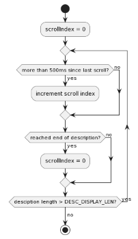

<!--
http://www.plantuml.com/plantuml/uml/TOynJyCm48Nt-nLlJ0UaB2oDA4MqGwKA8NLYggpuGYpPvyZd2FZtE35CK4ydltVVP-yrcvJdu6aTYBRQf-ZzIIn_uW5jHvHuOfC9S0EQ41CZZqPmtxP1eKvwXZUQKJSVDoLcGVF5kY6iPrjAYGFBRmbkuNThp5uPZSHQPh5kMARLbjZq8zlb5d60vRBkfkoY_Alvy_PR_FebV8pEbsp1LYeyotiUiSFXU7c-7awNr_FJs_LyV2a-fp-skvt4ZaXpd6ZFOkVWlm40
-->

### Example

For example, the message `CA0123456789` is sent.

The display should initially look like:

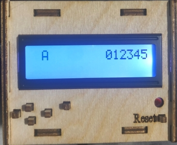

Then after 500ms, it should scroll a character, and look like:

Once the end of the channel description has been reached:

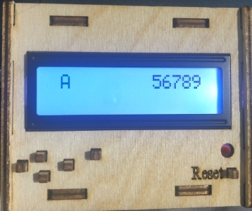

Scrolling should then start again, and the display should look like \ref{scroll-start}.

## Appendix {.unnumbered}

#### SCROLL Kotlin Script {#scroll-kt .unnumbered}

~~~ {.kotlin .numberLines}
import kotlin.math.absoluteValue

// to see difference when using total average
const val TOTAL_AVERAGE = 0

fun main(vararg args: String) {
    val results = mutableMapOf<Int, MutableList<Double>>()

    repeat(1_000) {
        val a = Alpha(300)
        a()
        a.avrgDiffResults.forEach { (alpha, diff) ->
            results.computeIfAbsent(alpha) { mutableListOf() }
                .add(diff)
        }
    }

    results.mapValues { (alpha, diffs) -> diffs.average() }
        .apply {
            toSortedMap { d1, d2 ->
                // sort by ascending avrg (best avrg diff first)
                val a1 = this[d1]!!
                val a2 = this[d2]!!
                a1.compareTo(a2)
            }.forEach { (alpha, avrgDiff) ->
                if (alpha == TOTAL_AVERAGE)
                    println(" TOTAL  =  $avrgDiff".format(alpha))
                else
                    println("1 / %-2d  =  $avrgDiff".format(alpha))
            }
        }
}

class Alpha(val nRecents: Int) {
    val alphas = (2..64) + TOTAL_AVERAGE

    val alphasAvrgs = mutableMapOf<Int, Double>().apply {
        alphas.forEach {
            this[it] = 0.0
        }
    }
    val results = mutableMapOf<Int, MutableList<Double>>()
    val avrgDiffResults = mutableMapOf<Int, Double>()

    private val randomByte: Int
        get() = (0..255).random()

    val values = mutableListOf<Int>().apply {
        repeat(64) {
            add(randomByte)
        }
    }

    operator fun invoke() {
        val startAvrg = values.average()
        alphas.forEach {
            alphasAvrgs[it] = startAvrg
        }
        alphasAvrgs[TOTAL_AVERAGE] = values.sum().toDouble()

        for (i in 65..nRecents) {
            val added = randomByte.also { values.add(it) }
            val exact = values.averageLast(64)

            alphas.forEach {
                val diff: Double
                if (it == TOTAL_AVERAGE) {
                    val sum: Double = alphasAvrgs.getValue(it) + added
                    alphasAvrgs[it] = sum

                    val avrg: Double = sum / values.size

                     diff = (exact - avrg).absoluteValue
                } else {
                    val alpha: Double = 1.0 / it

                    var runningAvrg = alphasAvrgs.getValue(it)
                    runningAvrg = alpha * added + (1 - alpha) * runningAvrg
                    alphasAvrgs[it] = runningAvrg

                    diff = (exact - runningAvrg).absoluteValue
                }

                results.computeIfAbsent(it) { mutableListOf() }
                    .add(diff)
            }
        }

        // calculate avrgDiffResults
        results.forEach { (alpha, diffs) ->
            avrgDiffResults[alpha] = diffs.average()
        }
    }
}

fun List<Int>.averageLast(n: Int): Double {
    var sum: Double = 0.0
    var count: Int = 0

    for (i in this.lastIndex downTo this.lastIndex - n + 1) {
        sum += this[i]
        count++
    }
    return if (count == 0) Double.NaN else sum / count
}
~~~
