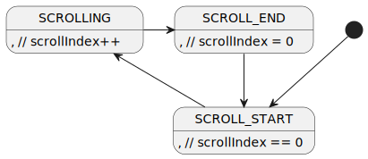

## FSMs

* *Describe the finite state machine at the centre of your
  implementation.  Show the states and the transitions.  Draw
  the states and transitions as a picture and include it here.*

Write a description of your states, what is being waited for, and the actions take during transition between states.

- INITIALISATION
  - setup
- SYNCHRONISATION
  - synchronising through Serial
- AFTER_SYNC
  - intermediate step after sync and b4 main
- MAIN_LOOP
  - main loop
- SELECT_HELD
  - waiting until select has been held for 1s
- SELECT_AWAITING_RELEASE
  - waiting for select button to be released
- BUTTON_PRESSED
  - waiting for stored button to be released


<!--
http://www.plantuml.com/plantuml/uml/XLB1Zfim4BtxA-OMgTgexPL3jUo6Tf5II0EhRLKgnE99OiaU8zjiktzVM09nVMWk4UEyDpDlthkrhZ6kLvAT14T0rRbNu6XR8pedD36MPccPnjkqYCiqpoAmwC3fxlxK4A6yWVD759smuUTY003rKdREL5InaM9HOkjs1gqjXS8RwCPFv7UzSvf6mWTM_CZk7_PvviqY3gjlAz0lQA108nfPaQOMeKC35bjDdCMVosHVZ-GpGmhhG1z0g4wYGdB8Ay8_3iaEagpVZNsDqwpUvlak0Yvi9vjNQ2SHjgBEw1Qj1K6jLeAEe8QgEUBmr-z6E3Xe0yzl0YOvh4YsoNrPFoJRJGGBP7eTDJuZd50EsupF7oqClmObDXRvp8sVuk7WsPTwFzHnaLpsigxdI0xIpVNDmh6NCNUFPPbdzMwV54NYRscTDiZFUWBMVmOozlFTBrX_Wd-34kG6rWCYyDVtUy7uPgw-hy1WY-85EHoCLhDf5z0RP_6GNUoS1lfsJCMSEwXelLvNDCbUNfrG63G93_QuUx_9dpAlaTTYEU3SVmpJ4MSFaI_fOdvO_6t302oRZyc1AJW1rpl1WhwMgskq82W1F4ZBmhf5uhsIVm40
-->

* *If there are other (sub) FSMs in your code then indicate those here.*

My code includes other FSMs in the extensions.


**TODO: FSM after all extensions*

## Data structures

* *Describe the data structures you are using to implement the
  Coursework.  These could be types (structures, enums), classes and
  constants.  Also describe the variables that are instances of these
  classes or types.*

Channels are implemented as an ordered singly-linked-list (ordered by channel ID) of structs (each channel is a node). The base characteristics of a channel are:

| Type | Name | Description |
| --- | --- | --- |
| char | id | This channel's ID (A-Z) |
| const char* | desc | This channel's description/name/title (max. 15 chars) |
| byte | descLen | The length of this channel's description |
| byte | max | This channel's maximum |
| byte | min | This channel's minimum |
| channel_s* | next | Pointer to the next created channel (by ID) |
| byte | scrollIndex | SCROLL: the start index of the currently displayed description |
| unsigned long | lastScrollTime | SCROLL: the time the description was last scrolled |
| ScrollState | scrollState | SCROLL: the current state of scrolling this channel's description |

The rest is determined by the set [RECENT_MODE](#recent).

The head of this linked list is stored statically in `Channel::headChannel`. When a new channel is created using `Channel::create`, the linked list is updated using `Channel::insertChannel`, which will insert the new channel into the appropriate position, according to the channel's ID.

* *When you have functions to update the global data structures/store,
  list these with a sentence description of what each one does.*

| Function | Description |
| --- | --- |
| `Channel::create(char id, const char* desc, byte descLen)` | Creates a new channel with the provided ID and description if not already created, else updates description of channel |
| `Channel::insertChannel(Channel* ch)` | Inserts the given channel into the linked list of channels in its appropriate position |


When processing incoming messages while select is being held, I encountered a problem where sometimes the Serial wouldn't have all things entered ready, e.g. I entered `VA5` but `Serial.available()` would return `2`

## Debugging

* *if you have code used to help you debug that is now commented out or
  managed by C macros, then keep this in your submission.  If you have
  other things to say, then put them here.*

Debug functions generally start with '`_`', and are commented with '`// debug`'.

The program will only send debug messages if the `DEBUG` macro is defined as a truthy value (non-zero number).

Right after syncronisation, the program sends a few debug messages about the channels that have been created from the EEPROM.

Whenever an erroneous message is sent, a DEBUG message about it is sent just before the ERROR message.

## Reflection

* *200–500 words of reflection on your code.  Include those things that
  don’t work as well as you would like and how you would fix them.*

I am very happy with my code. I think I thought of some ingenious solutions to some problems, such as managing the 64 most recent values and managing channels - using linkedlists is more memory friendly, at least initially, than using arrays. I believe everything works as desired.

I am also happy that I was able to mostly eliminate my use of intermediate short-lived strings (e.g. substrings) by directly accessing the initial string, saving some memory on the stack. For example, when displaying the channel description for the NAMES extension (`NAMES_SCROLL::displayChannelName(int, Channel*)`), instead of storing the substring of the channel's description (for scrolling purposes) then displaying it, I directly accessed the buffer.


Though I am kind of unhappy that I mixed C & C++ constructs and didn't necessarily try to stick to one.


I also feel like my program didn't properly reflect a proper finite-state machine. Some things could have been states, for example:

- when an incoming message does not conform to the protocol, the program could transfer to the state `ERROR`
- `ERROR` would essentially do what `messageError(char, ...)` does, then transfer the program back to the state `MAIN_LOOP`

But I felt that this did not make sense to be a state as the program flow for this would be more akin to a flowchart than a state machine.

## Extension Features {.unnumbered}

* *For each extension feature you have implemented describe the
  additional code and changes to your FSM .  Give examples of types,
  variables and code that is important.*

* *do not write anything here--put it in the subsections following.*

* ***Delete the text from Extension Features to here***

## UDCHARS

The namespace `UDCHARS` contains the code relating to the UDCHARS extension.

The following macros were defined, for use when creating and displaying the custom characters:

- `UP_ARROW_CHAR`   0
- `DOWN_ARROW_CHAR` 1

The only change to the FSM was that in the `INITIALISATION` state, the custom characters are defined (highlighted by italics):


<!--
http://www.plantuml.com/plantuml/uml/BSknQWGX4CRntgUO1pWmzLQtkHGHmYLaDzqsehCew2Wp8o5l7uJj_XzylxkePnsrc9GZ0jQkVn1H0kUkkP4nxkbsjtwuRTtTvtC1GGLj_P4y4PORNB4i2Nsy1cW36gLqvOCECubWmQ1VZ29xhdY3FXFZwr1jDC7Bl5eRySo448Peg-2Pso-4vDa7HHOu6yFFs-Dz_TwiDNUaE6hv1m00
-->

In my code, this change was realised by calling `UDCHARS::createChars()` in the `INITIALISATION` state (line 781):


### Defining

The custom characters are defined in `UDCHARS::createChars()`, they were designed as 2 chevrons pointing in the appropriate direction (mirrored vertically), using [chareditor.com](https://chareditor.com):


### Displaying

The arrows can be displayed to the lcd using `UDCHARS::displayUpArrow(bool)` and `UDCHARS::displayDownArrow(bool)`.

These functions have a single parameter `bool display`, which determines whether the arrows is printed to the lcd or a space is printed instead. This is indicative of whether a channel exists above the current `topChannel` or a channel exists below the current `btmChannel`.


Which are called in `updateDisplay(Channel*, HciState)`:


### Example

For example, if channels `A`, `B` and `C` have been created, the Arduino should look like:


As there are no channels before ("above") `A`, the up arrow is not displayed, a space is displayed instead. As there is a channel after ("below") `B`, the down arrow is displayed.

## FREERAM

The namespace `FREERAM` contains the code relating to the FREERAM extension.

The function `FREERAM::<unnamed>::freeMemory()` returns the number of bytes currently available in the Arduino's SRAM.

This can displayed to the screen, left justified, using `FREERAM::displayFreeMemory(byte)`:


This is called by `selectDisplay()`; once SELECT has been held for at least 1 second. The Arduino should look like:


## HCI

*In documentation, show LoC and thinking behind mechanism to display subsets of list of channels*

HCI is implemented using a finite state machine with the states:

- NORMAL
  - display all channels
- LEFT_MIN
  - display channels where the current value is beyond the minimum
- RIGHT_MAX
  - display channels where the current value is beyond the maximum


<!--
http://www.plantuml.com/plantuml/uml/bOzDImD138Rlyojo5le7F4XxyAFGLYWU11KPTe8RoAJ39AFkltSPTJyK5deBUH-Uv5sh-Mmbicif861Cra50RJ8bevCuTxW_xZUxImYaYNq7dXcQreiWgzjTtpoyxhU7CJu9TqCE7sGja2aq9MSKWsTvzrmG65N1UgocaOHYYUwulRthVPl7itrl6RrXdYZzPrMwfuiNMAskuBl7Jvsw6Pwl4wICgXZ69nQOt_N4_8UO7XfhrV6_PfaQWjcrERD62INo5m00
-->

This base of the HCI FSM is realised by the enum `HciState` and the function `Channel#meetsHciRequirement(HciState)`.


## EEPROM

*In documentation, indicate how lay out use of EEPROM, which LoC and functions I use to store information*

The namespace `_EEPROM` contains the code relating to the FREERAM extension.


Each channel occupies 26 bytes in the EEPROM:

| # of Bytes | Description |
| ----- | --- |
| 1 | ID |
| 1 | Maximum value |
| 1 | Minimum Vaue |
| 1 | Description length |
| 15 | Description |
| 7 | My student ID |

The beginning address for a channel is calculated using `(id - 'A') * 26`. This creates a distance of 26 bytes between the beginning addresses of each channel (A: 0, B: 26, C: 52, etc.).

The mechanism to determine whether the values were written by me is a 3 step process:
1. Check that the written student ID is equals to my student ID
2. Check that the written ID matches the ID of the channel that should be written in that address
3. Check that the written description length is between 1 and 15 inclusive

Thus it is simple to 'invalidate' any written channel: by modifying the values written such that they fail any step in the above process, for example setting the written ID to '@'.

I use the namespace `_EEPROM` for all functions relating to using the EEPROM, mainly `_EEPROM::updateEEPROM(Channel*)` and `_EEPROM::readEEPROM()`.

As channels are implemented as a linked-list, `_EEPROM::readEEPROM()` returns the head of a linked-list of EEPROM-read channels.

## RECENT

*In documentation, indicate the names and locations of the data structures used to store the recent values*

*running sum?*

As RECENT seems to be impossible without making any compromise, it is implemented in 3 different ways, which make different compromises:

1. using a [queue with a maximum size](#queue-linked-list)
2. using a [circular array](#circular-array)
3. using an [exponential moving average](#exponential-moving-average)

You can choose which one the program uses by changing the macro `RECENT_MODE`, it should only be defined as one of the following defined macros:

- `LL` (linked-list as queue)
- `ARRAY` (circular array)
- `EMA` (exponential moving average)

If it is defined as any other value, the program will not compile.

Using a queue and circular array are similar because they store the most recent values


### Queue (Linked List)

I use a queue (implemented with a singly-linked-list), with a maximum size defined by the macro `MAX_RECENT_SIZE`, which once exceeded will discard the head value to manage the most recent values for a channel.

`Channel::recentHead` stores the head of this linkedlist, and can be used for all list-related operations.

While using a linked-list will start off using less memory than an aray, because each node will use 5 bytes (1 for the value and 4 for the pointer of the next node), the memory usage

But using a linked-list should be more memory-efficient, at least for a small number of entered values. However, the memory taken by the linked list increases by 5 bytes for each new value entered; so when (assuming `MAX_RECENT_SIZE` = 64) 64 values have been entered, the linked list will take 320 bytes which is a lot more than the 64 bytes an array will take.

| Type | Name | Description |
| --- | --- | --- |
| RecentNode* | recentHead | the head of the RECENT linked list for this channel |
| RecentNode* | recentTail | the tail of the RECENT linked list for this channel |
| byte | recentLen | the number of recent values currently stored |

### Circular Array

I use a circular byte array, keeping track of:
- the index of the oldest value
- the number of values that have been entered

Although using a a circular array would initially use less memory than a linked list, in the long run the array would use less memory, thus allowing an array of a larger size than the maximum size of the linked list, giving a more accurate average of the last 64 values.

| Type | Name | Description |
| --- | --- | --- |
| byte* | recents | The array |
| unsigned long | nRecents | The number of values entered |

### Exponential Moving Average

I had to make a choice between using the average of all values entered and using an exponential moving average (EMA). I decided to implement an EMA as it is more accurate for the average of the last 64 values. More specifically, as the numbers of values entered increases, the more accurate an EMA is over a total average.

The EMA implementation is based upon this formula:

*TODO: dont try and explain how it works, but explain the problem with when <64 values have been entered (use wikipedia page?), and how i solved it by essentially using a total average*


<!--
https://render.githubusercontent.com/render/math?math=y[n]%20=%20\alpha%20x[n]%20%2b%20(1-\alpha)%20y[n-1]
-->


In my implementation of an EMA, the average of the first 64 values is pretty much exaxtrasasdsadasda


It makes sense to do as you won't be able to store the 64 most recent values anyway, and thus calculating the average of the e.g. 32 most recent values will be as estimate for the average of the 64. So a compromise has to be made of estimating

| Type | Name | Description |
| --- | --- | --- |
| byte | data | The current value of this channel |
| double | runningAvrg | The current average |
| unsigned long | runningSumN | The number of values that have been entered to this channel |

## NAMES

*Write about this extension*

*In documentation, indicate data structure used to store the channel name and how it is printed to the display*

indicate data structure used to store the channel name and how it is printed to the display

A channel's description/name is stored in a `const char*`.It is printed to the display using `lcd.print` with padded spaces on the end to overwrite the description previously displayed.

## SCROLL

*Write about this extension*

*In documentation, highlight parts of FSM required for this particular requirement and the LoC and functions that carry this implementation*

SCROLL and NAMES are implemented together as they go hand-in-hand, in the namespace `NAMES_SCROLL`.

It is implemented using a flowchart:




<!--
http://www.plantuml.com/plantuml/uml/SoWkIImgAStDuSh8J4bLICqjAAbKI4ajJYxAB2Z9pC_ZuWfs3lBtyOaF3d4C2h5Iq57GrrS0okRdv7ZcfQHMADZQAXX0rNZwkOCK006g6crjc26kVYvW5UY6WCpWYjQALT3LjLD0jX35Th0it2g4fGf0OOG5I7PX6iVba9gN0l8j0000
-->

It essentially displays a substring of the channel description

```bash
pandoc doc.md --number-sections --output=output.pdf --template=coa202.latex --shift-heading-level-by=-1
pandoc doc.md -N -o output.pdf --template=coa202.latex --shift-heading-level-by=-1

--pdfengine=xelatex if having alpha char
```

### Gradescope Tagging

After deleting the sections from submission onwards there should be a tag on every page.  If you have an untagged page, then find a tag for it.  There are tags for the title page, data structure pages, fsms, testing and each extension.
